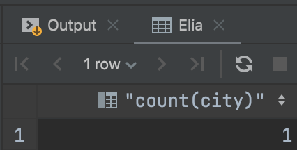
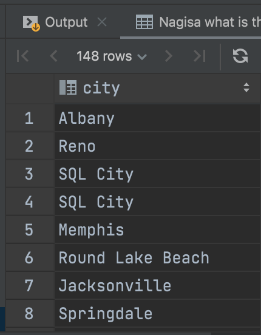
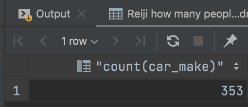
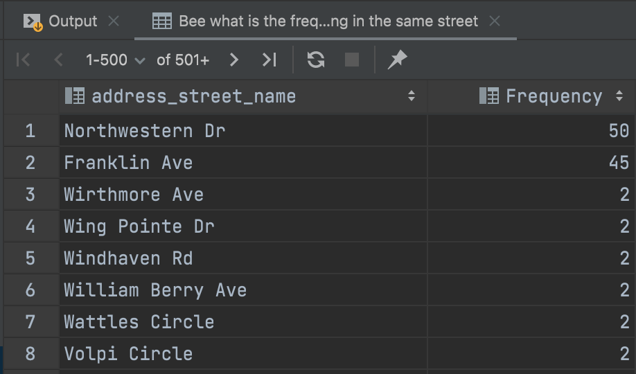
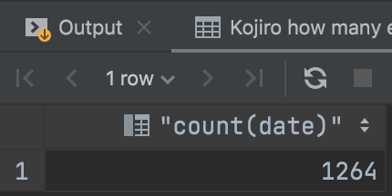
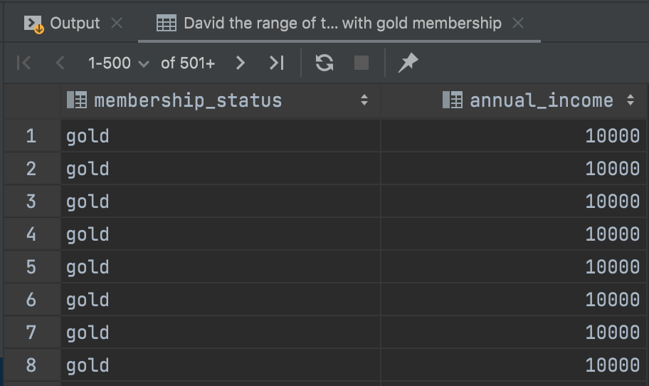
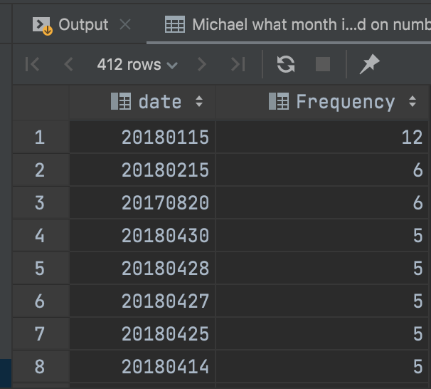
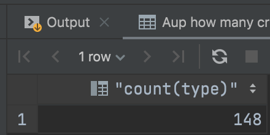

```.py
-- Elia
select count(city) from crime_scene_report WHERE type = 'theft' and city = 'SQL City';
```

```.py
-- Nagisa what is the city with more reports typed "murder"
select city from crime_scene_report where type like 'murder';
```

```.py
-- Reiji how many people drive a Mercedez benx
select count(car_make) from drivers_license WHERE car_make = 'Mercedes-Benz';
```

```.py
-- Bee what is the frequency of people living in the same street
select address_street_name, count(address_street_name) 'Frequency'
from person group by address_street_name order by count(address_street_name) desc;
```

```.py
-- Kojiro how many events happened on facebook during July 2017
select count(date) from facebook_event_checkin WHERE date > 20170700 and date < 20170800;
```

```.py
-- David the range of the annual income for individual with gold membership
Select membership_status, annual_income from person inner join income i on person.ssn inner join get_fit_now_member g on person.name = g.name order by annual_income asc;
```

```.py
-- Michael what month is the most dangerous based on number of crimes
select date, count(date) 'Frequency'
from crime_scene_report group by date order by count(date) desc;
```

```.py
-- Aup how many crimes involve nudism
select count(type) from crime_scene_report WHERE type = 'arson';
```

