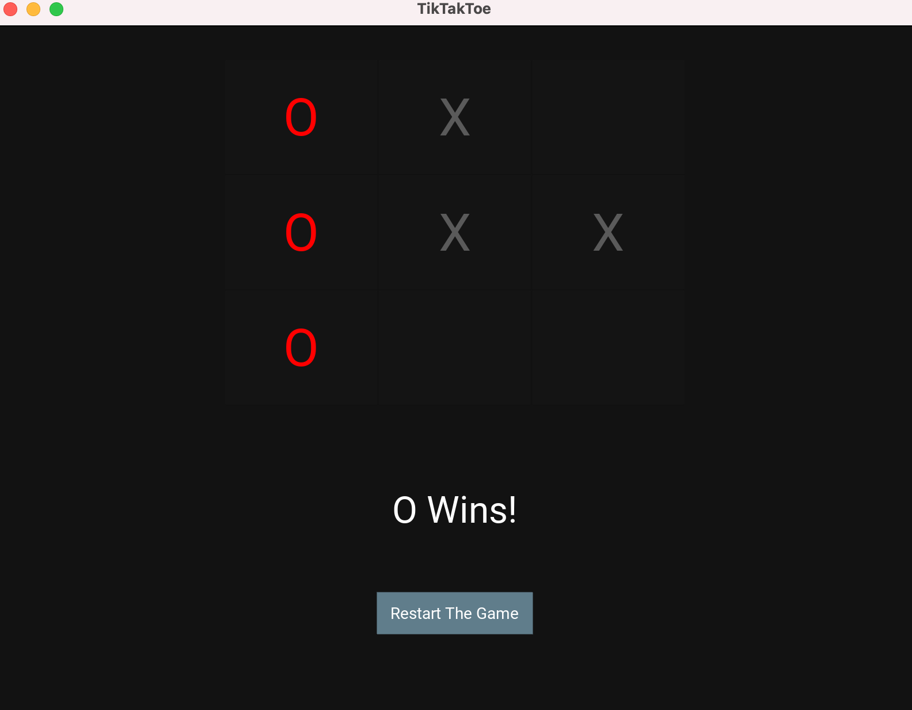

```.py
from kivy.lang import Builder
from kivymd.app import MDApp

class TikTakToe(MDApp):
    def build(self):
        self.theme_cls.theme_style = "Dark"
        self.theme_cls.primary_palette = "BlueGray"
        return Builder.load_file('TikTakToe.kv')

    '''Define who's turn it is'''

    turn = "X"

    '''Keep track of win or lose'''

    winner = False

    def no_winner(self):
        if self.winner == False and \
        self.root.ids.btn1.disabled == True and \
        self.root.ids.btn2.disabled == True and \
        self.root.ids.btn3.disabled == True and \
        self.root.ids.btn4.disabled == True and \
        self.root.ids.btn5.disabled == True and \
        self.root.ids.btn6.disabled == True and \
        self.root.ids.btn7.disabled == True and \
        self.root.ids.btn8.disabled == True and \
        self.root.ids.btn9.disabled == True:
            self.root.ids.score.text = "IT'S A TIE!"
    '''end game'''
    def end_game(self, a,b,c):
        self.winner = True
        a.color = "red"
        b.color = "red"
        c.color = "red"
        '''disable the buttons'''
        self.disable_all_buttons()
        '''set label for winner'''
        self.root.ids.score.text = f"{a.text} Wins!"

    def disable_all_buttons(self):
        '''disable the buttons'''
        self.root.ids.btn1.disabled = True
        self.root.ids.btn2.disabled = True
        self.root.ids.btn3.disabled = True
        self.root.ids.btn4.disabled = True
        self.root.ids.btn5.disabled = True
        self.root.ids.btn6.disabled = True
        self.root.ids.btn7.disabled = True
        self.root.ids.btn8.disabled = True
        self.root.ids.btn9.disabled = True

    def win(self):
        '''across'''
        if self.root.ids.btn1.text != "" and self.root.ids.btn1.text == self.root.ids.btn2.text and self.root.ids.btn2.text == self.root.ids.btn3.text:
            self.end_game(self.root.ids.btn1, self.root.ids.btn2, self.root.ids.btn3)

        if self.root.ids.btn4.text != "" and self.root.ids.btn4.text == self.root.ids.btn5.text and self.root.ids.btn5.text == self.root.ids.btn6.text:
            self.end_game(self.root.ids.btn4, self.root.ids.btn5, self.root.ids.btn6)

        if self.root.ids.btn7.text != "" and self.root.ids.btn7.text == self.root.ids.btn8.text and self.root.ids.btn8.text == self.root.ids.btn9.text:
            self.end_game(self.root.ids.btn7, self.root.ids.btn8, self.root.ids.btn8)

        '''Down'''

        if self.root.ids.btn1.text != "" and self.root.ids.btn1.text == self.root.ids.btn4.text and self.root.ids.btn4.text == self.root.ids.btn7.text:
            self.end_game(self.root.ids.btn1, self.root.ids.btn4, self.root.ids.btn7)

        if self.root.ids.btn2.text != "" and self.root.ids.btn2.text == self.root.ids.btn5.text and self.root.ids.btn5.text == self.root.ids.btn8.text:
            self.end_game(self.root.ids.btn2, self.root.ids.btn5, self.root.ids.btn8)

        if self.root.ids.btn3.text != "" and self.root.ids.btn3.text == self.root.ids.btn6.text and self.root.ids.btn6.text == self.root.ids.btn9.text:
            self.end_game(self.root.ids.btn3, self.root.ids.btn6, self.root.ids.btn9)

        '''Diagonal'''

        if self.root.ids.btn1.text != "" and self.root.ids.btn1.text == self.root.ids.btn5.text and self.root.ids.btn5.text == self.root.ids.btn9.text:
            self.end_game(self.root.ids.btn1, self.root.ids.btn5, self.root.ids.btn9)

        if self.root.ids.btn3.text != "" and self.root.ids.btn3.text == self.root.ids.btn5.text and self.root.ids.btn5.text == self.root.ids.btn7.text:
            self.end_game(self.root.ids.btn3, self.root.ids.btn5, self.root.ids.btn7)

        self.no_winner()

    def presser(self, btn):
        if self.turn == "X":
            btn.text = "X"
            btn.disabled = True
            self.root.ids.score.text = "O's Turn!"
            self.turn = "O"
        else:
            btn.text = "O"
            btn.disabled = True
            self.root.ids.score.text = "X's Turn!"
            self.turn = "X"

        '''check to see if won'''
        self.win()


    def restart(self):
        ''' Restart who's turn it is'''
        self.turn = "X"
        ''' Enable the buttoms'''
        self.root.ids.btn1.disabled = False
        self.root.ids.btn2.disabled = False
        self.root.ids.btn3.disabled = False
        self.root.ids.btn4.disabled = False
        self.root.ids.btn5.disabled = False
        self.root.ids.btn6.disabled = False
        self.root.ids.btn7.disabled = False
        self.root.ids.btn8.disabled = False
        self.root.ids.btn9.disabled = False

        '''Clear the buttons'''
        self.root.ids.btn1.text = ""
        self.root.ids.btn2.text = ""
        self.root.ids.btn3.text = ""
        self.root.ids.btn4.text = ""
        self.root.ids.btn5.text = ""
        self.root.ids.btn6.text = ""
        self.root.ids.btn7.text = ""
        self.root.ids.btn8.text = ""
        self.root.ids.btn9.text = ""

        '''reset the button colors'''
        self.root.ids.btn1.color = "green"
        self.root.ids.btn2.color = "green"
        self.root.ids.btn3.color = "green"
        self.root.ids.btn4.color = "green"
        self.root.ids.btn5.color = "green"
        self.root.ids.btn6.color = "green"
        self.root.ids.btn7.color = "green"
        self.root.ids.btn8.color = "green"
        self.root.ids.btn9.color = "green"

        ''' reset the score label'''
        self.root.ids.score.text = "X GOES FIRST!"

        '''reset the winner variabke'''
        self.winner = False

TikTakToe().run()

MDFloatLayout:

    MDGridLayout:
        size_hint: .5, .5
        pos_hint: {'center_x': .5, 'center_y': .7}
        cols: 3
        rows: 3

        Button:
            id: btn1
            text: ""
            font_size: "45sp"
            on_release: app.presser(btn1)

        Button:
            id: btn2
            text: ""
            font_size: "45sp"
            on_release: app.presser(btn2)

        Button:
            id: btn3
            text: ""
            font_size: "45sp"
            on_release: app.presser(btn3)

        Button:
            id: btn4
            text: ""
            font_size: "45sp"
            on_release: app.presser(btn4)

        Button:
            id: btn5
            text: ""
            font_size: "45sp"
            on_release: app.presser(btn5)

        Button:
            id: btn6
            text: ""
            font_size: "45sp"
            on_release: app.presser(btn6)

        Button:
            id: btn7
            text: ""
            font_size: "45sp"
            on_release: app.presser(btn7)

        Button:
            id: btn8
            text: ""
            font_size: "45sp"
            on_release: app.presser(btn8)

        Button:
            id: btn9
            text: ""
            font_size: "45sp"
            on_release: app.presser(btn9)

    MDLabel:
        id:score
        font_size: "32sp"
        text: "X GOES FIRST!"
        halign: "center"
        pos_hint: {"center_y": .3}

    MDRaisedButton:
        id: restart
        text: "Restart The Game"
        pos_hint: {'center_x': .5, 'center_y': .15}
        on_release: app.restart()
```
I followed some code from the following video https://www.youtube.com/watch?v=PAnpsrEOQ4s


