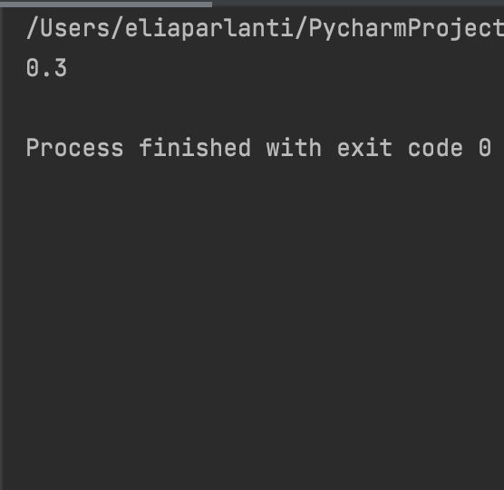

  When you write 0.1 + 0.2 in the terminal, the answer is 0.30000000000000004. This is because, although humans count in base 10, computers count in base 2. When adding the two decimals, we essentially add 1/5 and 1/10. However, a computer can't do this as the only decimals they can calculate precisely are ones with a denominator that are a root of 2. Such as, 1/2, 1/4, 1/8, etc.
  
  There are two solutions to this problem. The first is to round the number. You can cut off after a certain decimal which will give you 0.3 as the answer of 0.1 + 0.2. Another solution is the following:

```.py

from decimal import Decimal

one = Decimal('0.1')
two = Decimal('0.2')
three = Decimal('0.3')
result = one + two
print(result)
```

