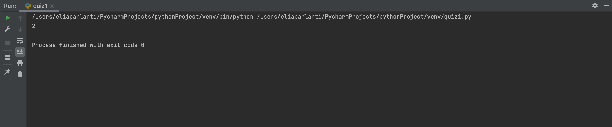
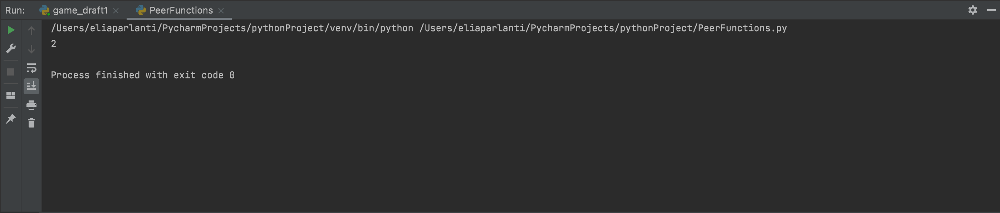

## Paolo's O's
```.py
def mystery_box(word):
    # How many O's are in the input
    answer = 0
    for i in range(len(word)):
        if word[i] == "o":
            answer += 1
    return answer
out = mystery_box("Paolo")
print(out)

```

## Beril's move repeated letters
```.py
def mystery_box(word1, word2):

## Ryu's Time
```.py
def mystery_box(hour1, minute1, hour2, minute2):
    # find the difference in time
    time1 = hour1*60+minute1
    time2 = hour2*60+minute2
    answer = abs(time1-time2)
    return answer
out = mystery_box(19, 25, 22, 13)
print(out)
```

