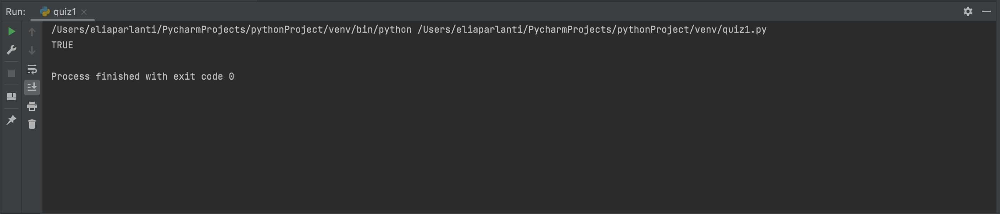

## Create a function where there are two inputs. If one of them equals 20 or if both added together equal 20 output should be "TRUE". If not, output should be "FALSE".
```.py
def makes20(A, B):
    if A == 20:
        answer = "TRUE"
    elif B == 20:
        answer = "TRUE"
    elif A + B == 20:
        answer = "TRUE"
    return answer
out = makes20(9,20)
print(out)
```

