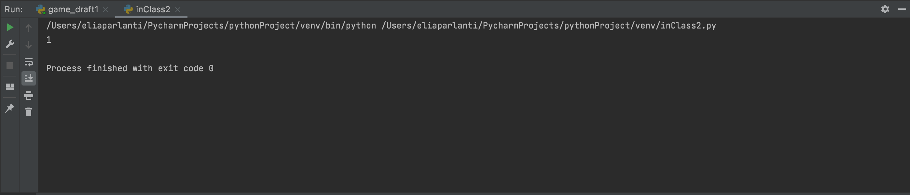

## quiz number 2
```.py
# find the difference between the largest and smallest input
def largestDistance(n1,n2,n3):
    if n1 > n2 and n1 > n3:
        greatest = mn1
    if n2 > n1 and n2 > n3:
        greatest = n2
    if n3 > n1 and n3 > n2:
        greatest = n2
    if n1 < n2 and n1 < n3:
        smallest = n1
    if n2 < n1 and n2 < n3:
        smallest = n2
    if n3 < n2 and n3 < n1:
        smallest = n3
    answer = greatest - smallest
    return answer
out = largestDistance(1,2,3)
print(out)
```


