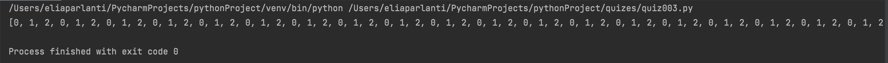

# Function that prints from 0 to the input minus 1, 100 times.
```.py
def rangePattern(num):
    answer = []
    a = 0
    for i in range(100):
        answer.append(a)
        a += 1
        if a >= num:
            a = 0
    return answer
out = rangePattern(3)
print(out)
```


