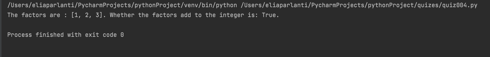
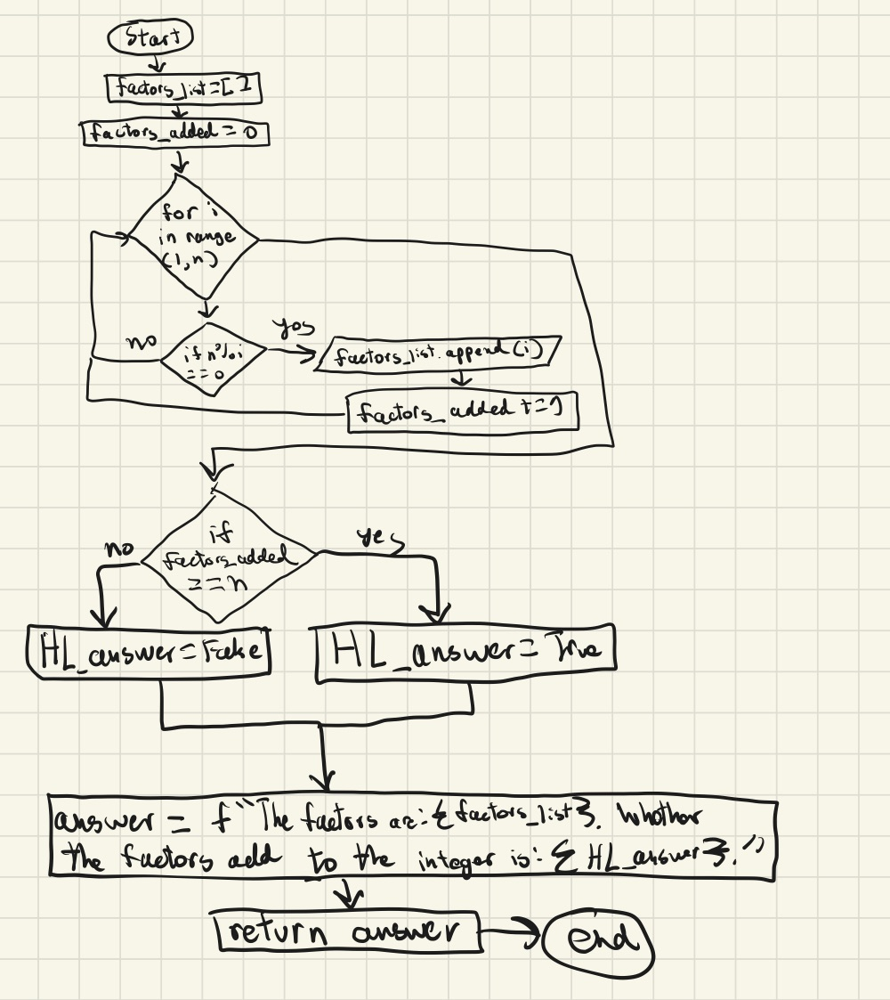

## Write a function that receives an integer N, and returns all its factors.  [HL] show also the addition of the factors show if the result is the same as N
```.py
def perfectN(n : int):
    # Function to divide an integer to its factors
    factors_list = []
    factors_added = 0
    for i in range(1, n):
        if n % i == 0:
          factors_list.append(i)
          factors_added += i
    if factors_added == n:
        HL_answer = True
    else:
        HL_answer = False
    answer = f"The factors are : {factors_list}. Whether the factors add to the integer is: {HL_answer}."
    return answer
output = perfectN(n = 6)
print(output)
```


