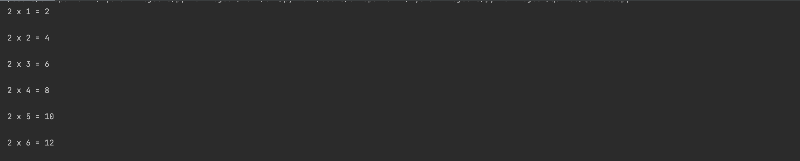
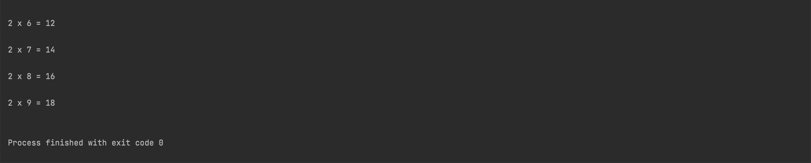
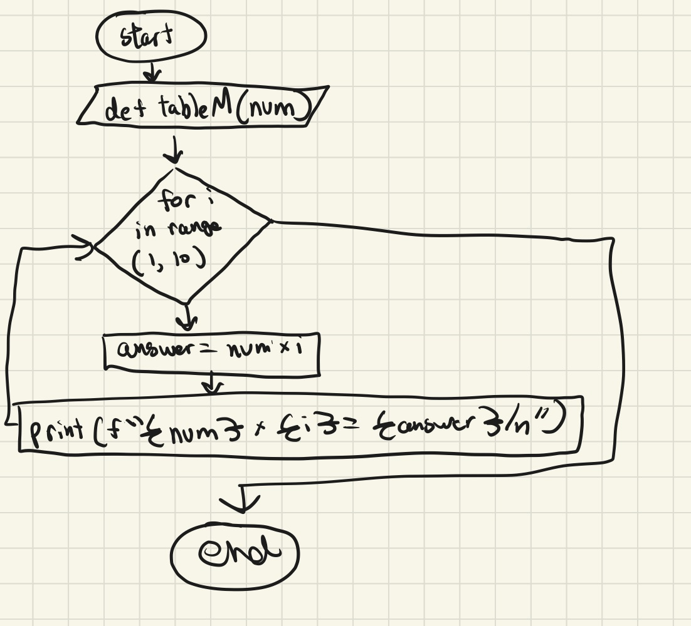

## Given an integer N, show the multiplication table. 
```.py
# Function that prints the multiplication table
def tableM(number):
    for i in range(1,10):
        answer = number * i
        print(f"{number} x {i} = {answer}\n")
out = tableM(2)
```



