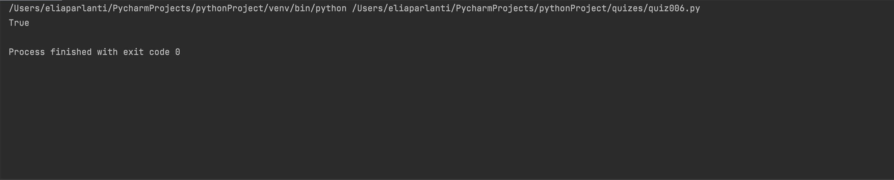

## Output TRUE if the given string begins with 'mix', except the 'm' can be anything, so 'pix', '9ix'..., all count.
```.py
def MixStart(phrase):
    # Function to check if mix is in the input but the first letter doesn't matter
    if phrase[1] == 'i' and phrase[2] == 'x':
        answer = True
    else:
        answer = False
    return answer
out = MixStart('pix snacks')
print(out)
```

