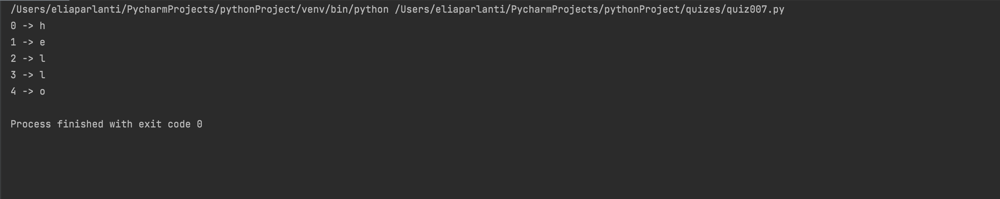

## Given a string, create a function that outputs each letter with its index
```.py
# Function 
def letter(word : str):
    for i in range(len(word)):
        answer = word[i]
        print(f"{i} -> {answer}")
letter('hello')
```


