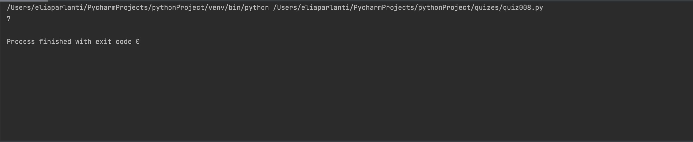

## Create a function. Inputs is an list of integers, find the largest absolute value.
```.py
def MaxAbs(list):
    answer = 0
    for i in range(len(list)):
        value = abs(list[i])
        if value >= answer:
            answer = value
    return answer

out = MaxAbs([-4, 5 , 6, -7])
print(out)
```


