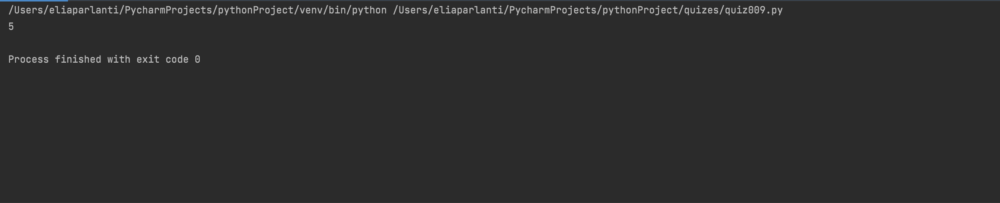

```.py
def missingNumber(list):
    answer  = 0
    for i in range(1, len(list)):
        if list[i] - list[i-1] != 1:
            answer = i + 1
    return answer
out = missingNumber([1,2,3,4,6,7])
print(out)
```

