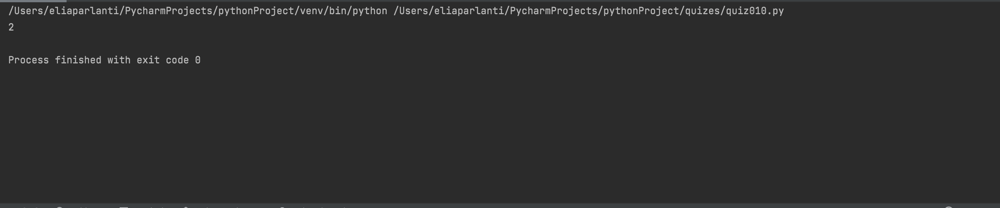

```.py
# Find the biggest difference in a list
def BigNeighbour(num):
    answer = 0
    for i in range(1, len(num)):
        if num[i] - num[i-1] != 1:
            if answer < num[i] - num [i-1]:
                answer = num[i] - num [i-1]
    return answer
out = BigNeighbour((1,2,3,5,6))
print(out)
```

