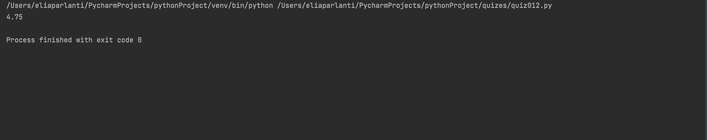
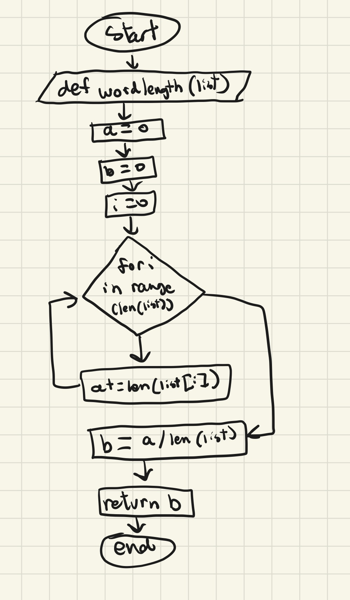

## Given an list of words, find the average word length.
```.py
def wordlength(list):
    a=0
    b=0
    i=0
    for i in range (len(list)):
        a += len(list[i])
    b=a/len(list)
    return b
out= wordlength(["Hello", "car", "travel","beach"])
print(out)
```


