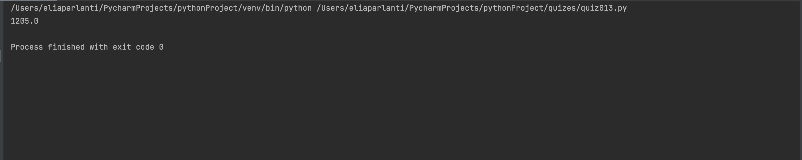

```.py
# Taxing products and then calculating the total price
def TaxCalc(items, price):
    # List of products
    food = ["bread", "rice", "pasta"]
    electronics = ["ipad", "laptop", "iphone"]
    liqueur = ["beer", "wine", "whiskey"]
    answer = 0
    for i in range (len(items)):
        if items[i] in food:
            answer += price[i] * 1.1
        if items[i] in electronics:
            answer += price[i] * 1.15
        if items[i] in liqueur:
            answer += price[i] * 1.2
    return answer
out = TaxCalc(["beer", "bread", "ipad"], [300,350,400])
print(out)
```


