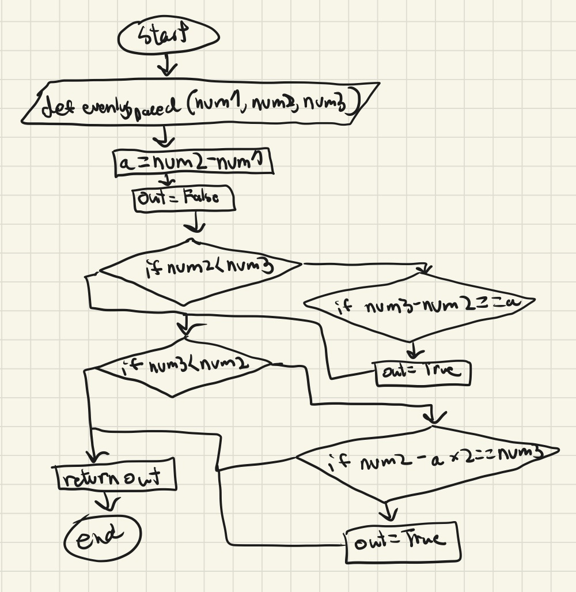

```.py
def evenlySpaced (num1,num2,num3):
    a=num2-num1
    out="False"
    if num2<num3:
        if num3-num2==a:
            out="True"
    if num3<num2:
        if num2-a*2==num3:
            out="True"
    return out
out = evenlySpaced(2,6,4)
print(out)
```


