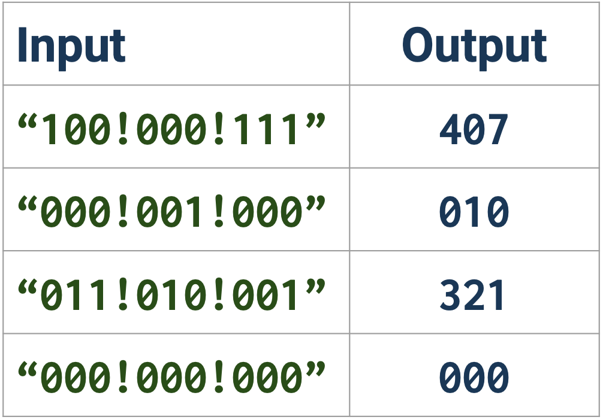
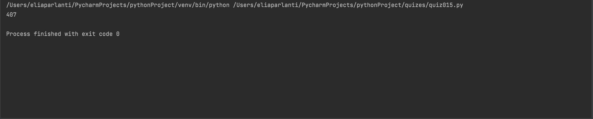
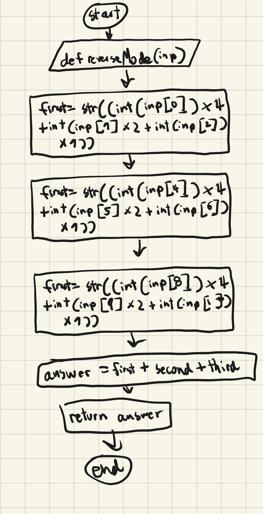

## Reverse Mode: Given the input/outputs shown, create the program that produces the output. 

```.py
def reverseMode(inp):
    first = str((int(inp[0])*4+int(inp[1])*2+int(inp[2])*1))
    second = str((int(inp[4])*4+int(inp[5])*2+int(inp[6])*1))
    third = str((int(inp[8])*4+int(inp[9])*2+int(inp[10])*1))
    answer = first+second+third
    return answer
out = reverseMode("100!000!111")
print(out)
```


