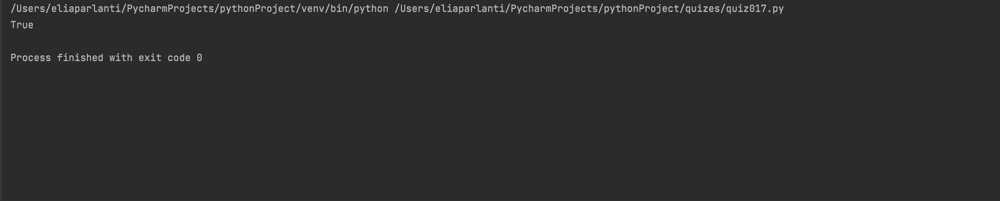

## For each pair of characters of an input String, swap every two characters. 
```.py
def traingle(a,b,c):
    if a+b > c:
        output = True
    if a+c > b:
        output = True
    if c + b > a:
        output = True
    else:
        output = False
    return output
out = traingle(5,6,3)
print(out)
```

