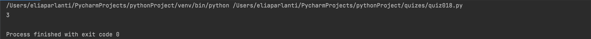
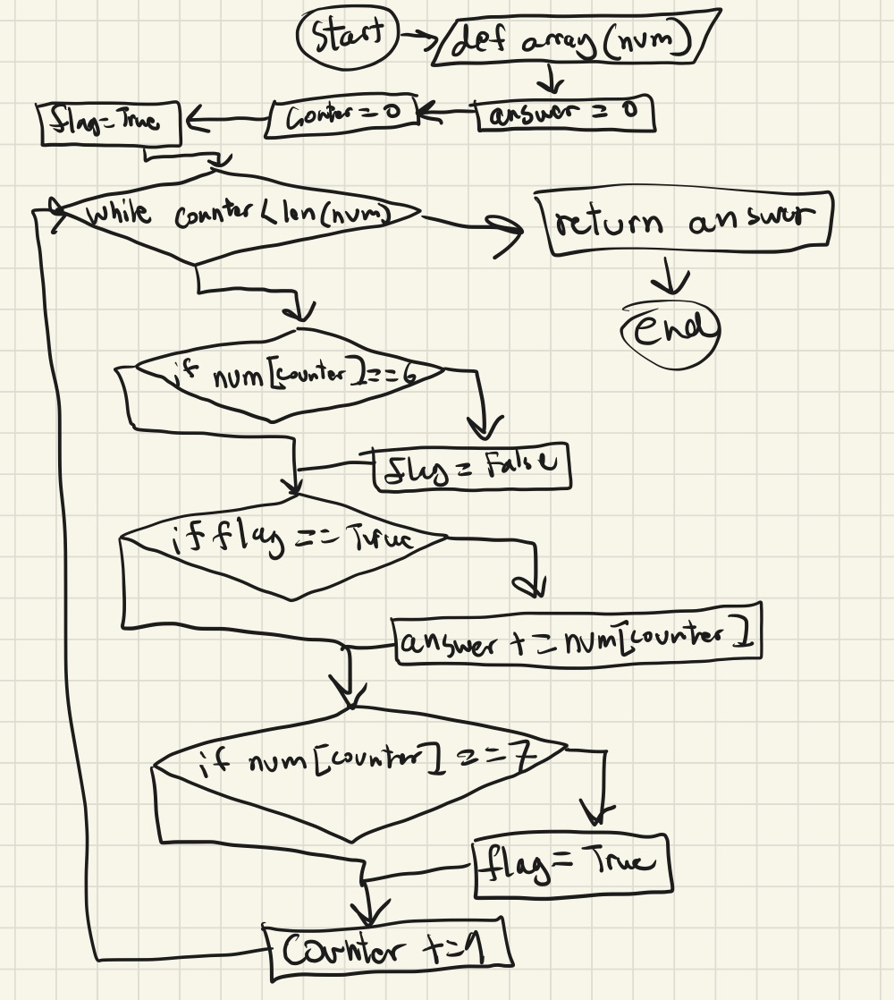

## Create a function that returns the sum of the numbers in the array, except ignore sections of numbers starting with a 6 and extending to the next 7 (every 6 will be followed by at least one 7). Return 0 for no numbers.
```.py
def array(num):
    answer = 0
    counter = 0
    flag = True
    while counter < len(num):
        if num[counter] == 6:
            flag = False
        if flag == True:
            answer += num[counter]
        if num[counter] == 7:
                flag = True
        counter += 1
    return answer
out = array([1,2,6,99,7])
print(out)
```


