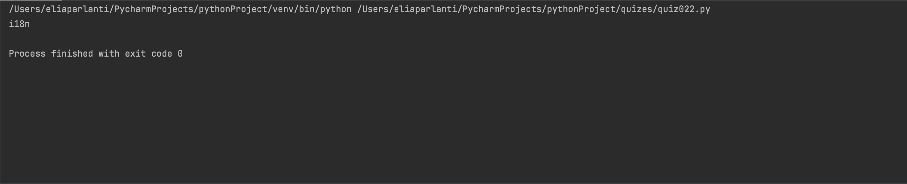

```.py
def blackbox(phrase):
    #Counts the number of letters inbetween the first and last letters.
    answer=""
    words=phrase.split()
    for words in words:
        if len(words)<=2:
            answer+=(words+" ")
        else:
            answer+=(words[0]+str(len(words)-2)+words[-1]+" ")
    return answer
#Test
a=blackbox("internationalization")
print(a)
```

