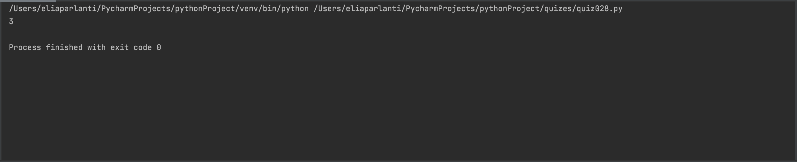

```.py
def findTwoDivisor(number: int):
    solution = 0
    a = 2
    for i in range(number // 2):
        if number % a == 0:
            solution += 1
        a += 2
    return solution

answer = findTwoDivisor(number=8)
print(answer)
```

