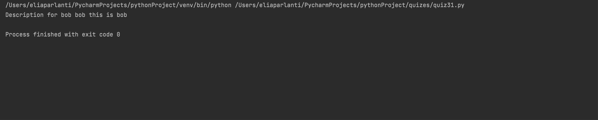

```.py
''' 
programme for location of a person
'''
class User:
    ''' this is the class for quiz31'''
    def __init__(my_user, name: str, username: str, information: str, location: list = None):
        my_user.name = name
        my_user.username = username
        my_user.information = information
        my_user.location = location
    #methods
    def get_location(my_user):
        return my_user.location
    def get_description(my_user):
        # concatenate the username with information
        return my_user.username + " " + my_user.information

bob=User(name="bob",username="bob",information="this is bob", location=["A22","ISAK"])
print(f"Description for bob {bob.get_description()}")
```

