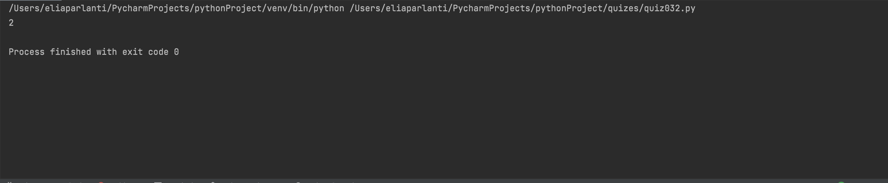

```.py
''' 
how many of one letter is in an input
'''
class countLetter:
    def __init__(self, text:str, letter:str):
        self.text=text
        self.letter=letter
    def counting(self):
        answer = 0
        ''' for loop to check the letters in the inputted phrase '''
        for i in range(len(self.text)):
            if self.text[i] == self.letter:
                answer += 1
        return answer

output = countLetter(text="The world is vast, vast", letter="a")
print(output.counting())
```

