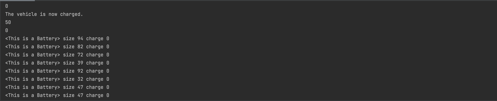

```.py
class vehicle:
    def __init__(self, brand, model, type):
        self.brand =brand
        self.model =model
        self.type=type
        self.gas_tank_size=14
        self.fuel_level=0

    def fuel_up(self):
        self.fuel_level=self.gas_tank_size
        print('Gas tank is now full.')

    def drive(self):
        print(f"the {self.model} is now driving.")

class ElectricVehicle(vehicle):
    def __init__(self, brand, model, type):
        super().__init__(brand,model,type)
        self.battery=Battery()
        self.charge_level=0

    def charge_car(self, new_value):
        self.battery.charge_bat(new_value)
        print('The vehicle is now charged.')

    def fuel_up(self):
        print('This vehicle has no fueld tank!')

class Battery:
#A class to represent a battery bank. By default its size is 20 kwh
    def __init__(self, size:int = 20):
        self.size=size
        self.charge_level = 0
    def get_charge(self):
        #this method returns the current charge level
        return self.charge_level
    def get_range(self):
        #This method returns an estimate of the km that the car can drive
        return 10*self.charge_level
    def charge_bat(self,new_value):
        self.charge_level = new_value

    def __repr__(self):
        return f"<This is a Battery> size {self.size} charge {self.charge_level}"

vehicle_object = vehicle('honda', 'Ridgeline', 'Truck')
a_subaru = vehicle('Subaru','Forester', 'Crossover')
an_suv = vehicle('Ford', 'Explorer', 'SUV')

my_tesla = ElectricVehicle('Tesla', 'Model X', 'car')
print(my_tesla.battery.get_charge())
my_tesla.charge_car(50)
my_tesla.battery.charge_bat(50)
print(my_tesla.battery.get_charge())

#create a battery
replacement_bat= Battery()
print(replacement_bat.get_charge())

import random
Stock_bats = []
for i in range(100):
    a_battery = Battery(size=random.randint(10,100))
    Stock_bats.append(a_battery)
    print(a_battery)

for i in range(100):
    Stock_bats[i].charge_bat(50)
    print(f"Charge level for battery {i} is {Stock_bats[i].get_charge()}")
```

