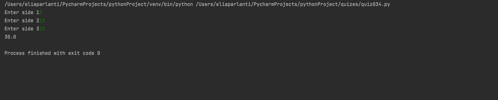

```.py
class polygon:
    ''' this class is for polygons'''
    def __init__(self, no_of_sides):
        self.n = no_of_sides
        self.sides = []

    def inputSides(self):
        for i in range(self.n):
            self.sides.append(int(input(f"Enter side {i+1}")))

    def showSides(self):
        for i in range(self.n):
            print(f"Side {i+1} is {self.sides[i]}")

class triangle(polygon):
    ''' this class is for triangle'''
    def sine(self):
        a=self.sides[0]
        b=self.sides[1]
        c=self.sides[2]
        cosc = (a**2 + b**2 - c**2) / (2 * a * b)
        sinec = (1-cosc**2)**0.5
        return sinec
    def area(self):
        '''calculating area of a triangle'''
        return 0.5 * self.sides[0] * self.sides[1] * self.sine()

triangle=triangle(3)
triangle.inputSides()
print(triangle.area())
```

