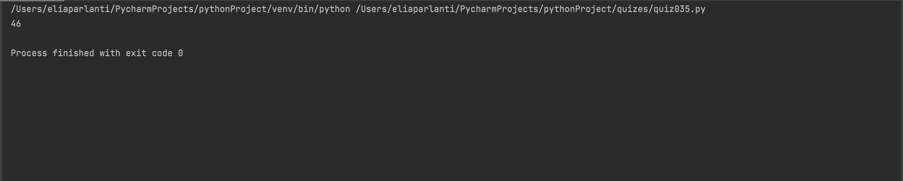

```.py
class Lily:
    def __init__(self, meters, seconds):
        self.meters=meters
        self.seconds=seconds

    def matchsticks(self):
        import math
        seconds2 = self.seconds / 100
        answer = self.meters / seconds2 / 5
        return math.ceil(answer)

out = Lily(250,110)
print(out.matchsticks())
```

