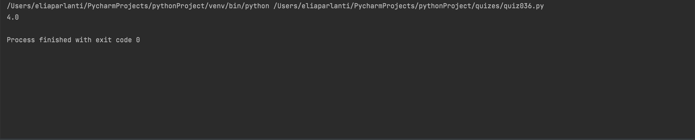

```.py
'''
1. Incapsulation, abstraction, inheritance, and polymorphism
2. A UML diagram is a table and at the top, there is the class. In the middle row, there are the attributes. Below, there are the methods.
3.'''
class UML:
    def __init__(self, results: list):
        self.results=results

    def getAverage(self):
        sum = 0
        tick = 0
        for i in range (len(self.results)):
            sum += self.results[i]
            tick += 1
        return sum / tick
out=UML([1,2,3,4,5,6,7])
print(out.getAverage())
```

