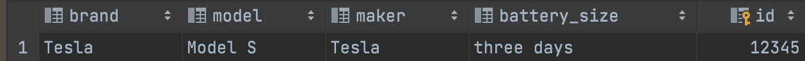

```.py
import sqlite3
''' Class to create a table that details variables about an electric car '''
class my_database():
    '''This is to connect to sqlite3'''
    def __init__(self, db_name):
        self.name = db_name
        self.connection = sqlite3.connect(self.name)
        self.cursor = self.connection.cursor()
''' def to create a table in a database '''
    def create(self):
        self.cursor.execute("""CREATE TABLE if not exists Electric_cars(
            id INTEGER primary key,
            brand VARCHAR(100),
            model VARCHAR(100),
            maker VARCHAR(100),
            battery_size VARCHAR(100)
        ); """)
db=my_database("quiz39.db")
db.create()
```

