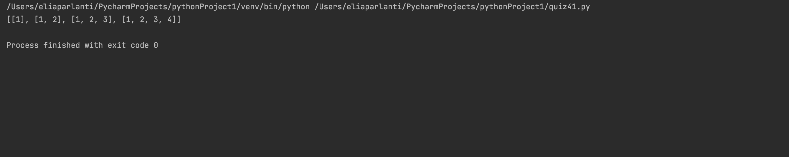

```.py
''' def to put automatically create lists in a list '''
def mapper(num):
    y=[]
    for i in range(1,num + 1):
        x = []
        '''This is to append a list in a list'''
        y.append(x)
        for a in range(i):
            x.append(a + 1)
    return y
print(mapper(4))
```

