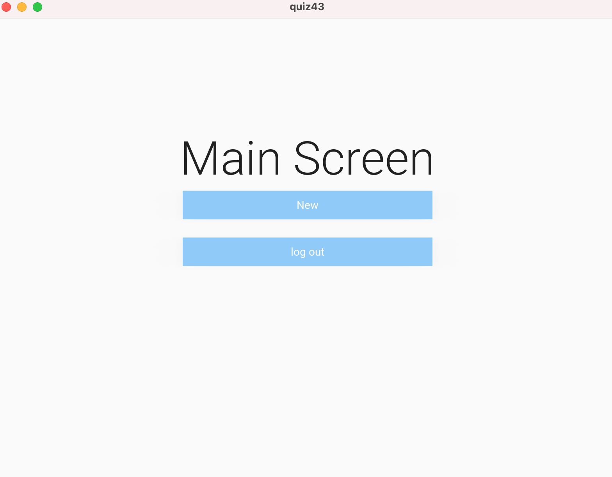

```.py
''' Application that follows the arrows in quiz43'''
'''Python code'''
from kivy.metrics import dp
from kivymd.app import MDApp
from kivymd.uix.screen import MDScreen

class MainScreen(MDScreen):
    pass

class LoginScreen(MDScreen):
    pass

class NewItemScreen(MDScreen):
    pass

class Screen(MDScreen):
    pass


class quiz43(MDApp):
    def build(self):
        return


m = quiz43()
m.run()
'''KivyMD code'''
ScreenManager:
    id: scr_manager

    LoginScreen:
        name: "LoginScreen"

    MainScreen:
        name: "MainScreen"

    NewItemScreen:
        name: "NewItemScreen"

<LoginScreen>
    MDLabel:
        text: "Menu"
        font_style: "H2"
        halign: 'center'
        pos_hint: {"center_x": 0.5, "center_y": 0.9}
        
'''button to go to the main screen'''

    MDRaisedButton:
        text: "Log in"
        pos_hint: {"center_x": 0.5, "center_y": 0.7}
        md_bg_color: app.theme_cls.primary_light
        width: root.width*0.4
        size_hint: None, None
        on_release:
            root.parent.current = "MainScreen"

<NewItemScreen>
    MDLabel:
        text: "New Item Screen"
        font_style: "H2"
        halign: 'center'
        pos_hint: {"center_x": 0.5, "center_y": 0.7}

'''button to go to the main screen'''

    MDRaisedButton:
        text: "Back"
        pos_hint: {"center_x": 0.5, "center_y": 0.6}
        md_bg_color: app.theme_cls.primary_light
        width: root.width*0.4
        size_hint: None, None
        on_release:
            root.parent.current = "MainScreen"

<MainScreen>
    MDLabel:
        text: "Main Screen"
        font_style: "H2"
        halign: 'center'
        pos_hint: {"center_x": 0.5, "center_y": 0.7}

'''button to go to the new items screen'''

    MDRaisedButton:
        text: "New"
        pos_hint: {"center_x": 0.5, "center_y": 0.6}
        md_bg_color: app.theme_cls.primary_light
        width: root.width*0.4
        size_hint: None, None
        on_release:
            root.parent.current = "NewItemScreen"

'''button to go to the log in screen'''

    MDRaisedButton:
        text: "log out"
        pos_hint: {"center_x": 0.5, "center_y": 0.5}
        md_bg_color: app.theme_cls.primary_light
        width: root.width*0.4
        size_hint: None, None
        on_release:
            root.parent.current = "LoginScreen"
```



