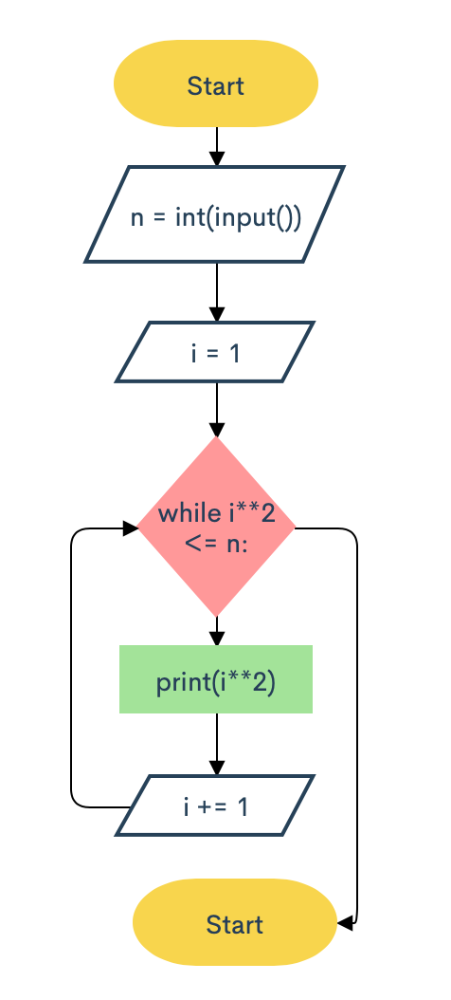
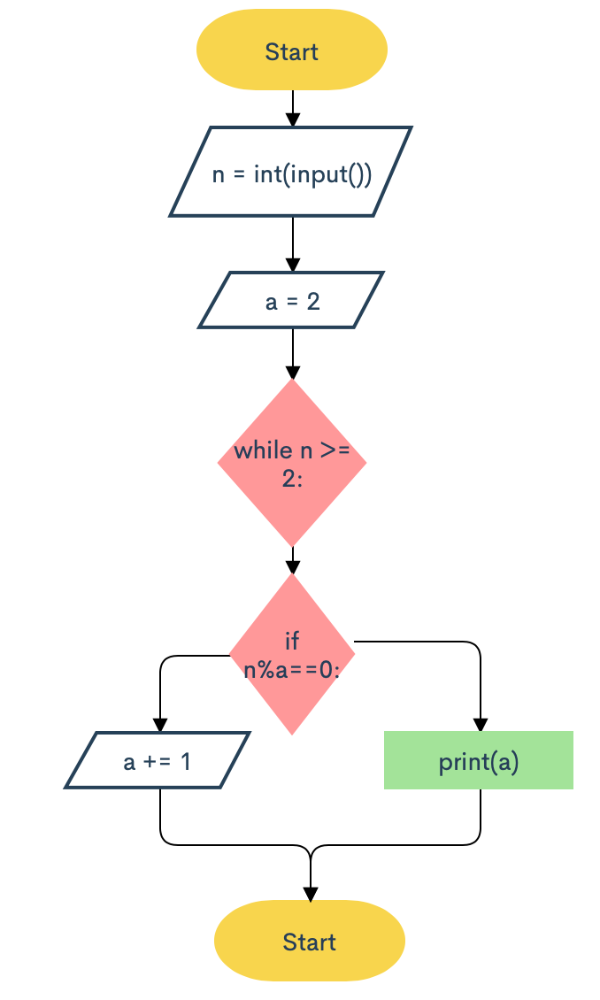
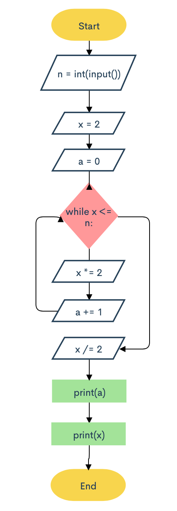
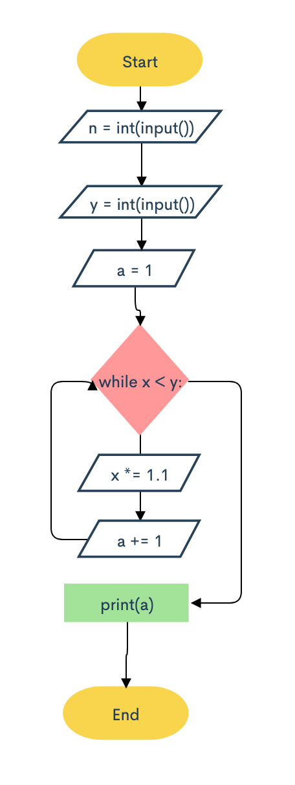
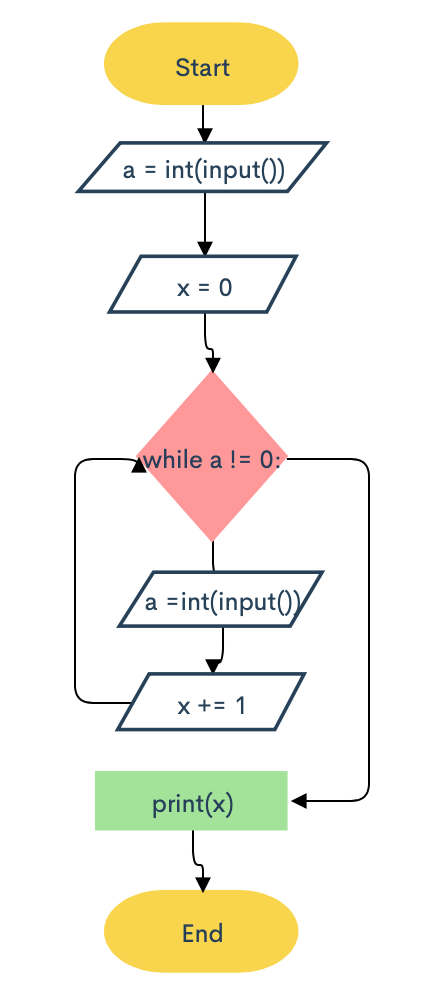
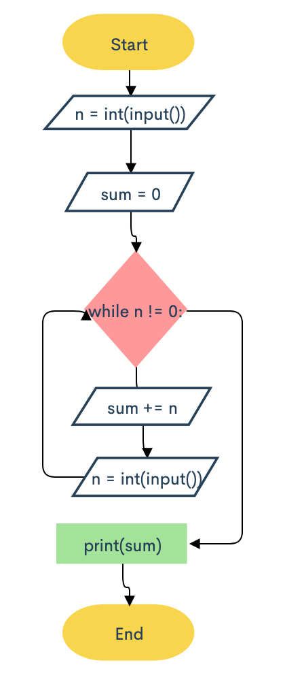
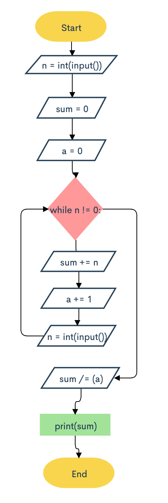
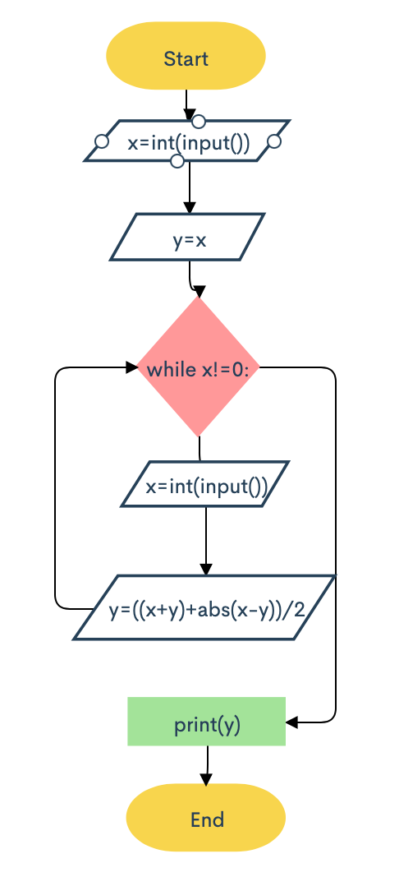

## List of squares
### For a given integer N, print all the squares of integer numbers where the square is less than or equal to N, in ascending order.
```.py
n = int(input())
for i in range(1, n+1):
    a = i ** 2
    if a <= n:
        print(a)

n = int(input())
i = 1
while i**2 <= n: 
  print(i**2)
  i += 1
```

## Least divisor
### Given an integer not less than 2. Print its smallest integer divisor greater than 1.
```.py
n = int(input())
for i in range(2, n+1):
    if n%i==0:
        print(i)
        break
        
n = int(input())
a = 2
while n >= 2:
    if n%a==0:
        print(a)
        break
    else:
        a += 1
```

## The power of two
### For a given integer N, find the greatest integer x where 2x is less than or equal to N. Print the exponent value and the result of the expression 2x.
```.py
n = int(input())
x = 2
for i in range(1, n):
    x *= 2
    if x > n:
        x/=2
        print(i)
        print(x)
        break


n = int(input())
x = 2
a = 0
while x <= n:
    x *= 2
    a += 1
x /= 2
print(a)
print(x)
```

## Morning jog
### As a future athlete you just started your practice for an upcoming event. Given that on the first day you run x miles, and by the event you must be able to run y miles. Calculate the number of days required for you to finally reach the required distance for the event, if you increases your distance each day by 10% from the previous day.
```.py
x = int(input())
y = int(input())
a = 1
while x < y:
    x *= 1.1
    a += 1
print(a)

x = int(input())
y = int(input())
a = 1
for i in range(1, y):
    if x < y:
        x *= 1.1
        a += 1
print(a)
```

## The length of the sequence
### Given a sequence of non-negative integers, where each number is written in a separate line. Determine the length of the sequence, where the sequence ends when the integer is equal to 0. Print the length of the sequence (not counting the integer 0). The numbers following the number 0 should be omitted.
```.py
x = 0
for i in range(20):
    a = int(input())
    x += 1
    if a == 0:
        x -= 1
        print(x)
        break


a = int(input())
x = 0
while a != 0:
    a =int(input())
    x += 1
print(x)
```

## The sum of the sequence
### Determine the sum of all elements in the sequence, ending with the number 0.
```.py
sum = 1
for i in range(20):
    n = int(input())
    sum += n
    if n == 0:
        break
print(sum-1)


n = int(input())
sum = 0
while n != 0:
    sum += n
    n = int(input())
print(sum)
```

## The average of the sequence
### Determine the average of all elements of the sequence ending with the number 0.
```.py
sum = 0
a = 0
for i in range(40):
    n = int(input())
    sum += n
    a += 1
    if n == 0:
        sum /= (a-1)
        print(sum)
        break


n = int(input())
sum = 0
a = 0
while n != 0:
    sum += n
    a += 1
    n = int(input())
sum /= (a)
print(sum)
```

## The maximum of the sequence
### A sequence consists of integer numbers and ends with the number 0. Determine the largest element of the sequence.
```.py
x=int(input())
y=x
while x!=0:
    x=int(input())
    y=((x+y)+abs(x-y))/2
print(y)


max = 0
element = -1
for i in range(50):
    element = int(input())
    if element > max:
        max = element
    elif element == 0:
        break
print(max)
```

